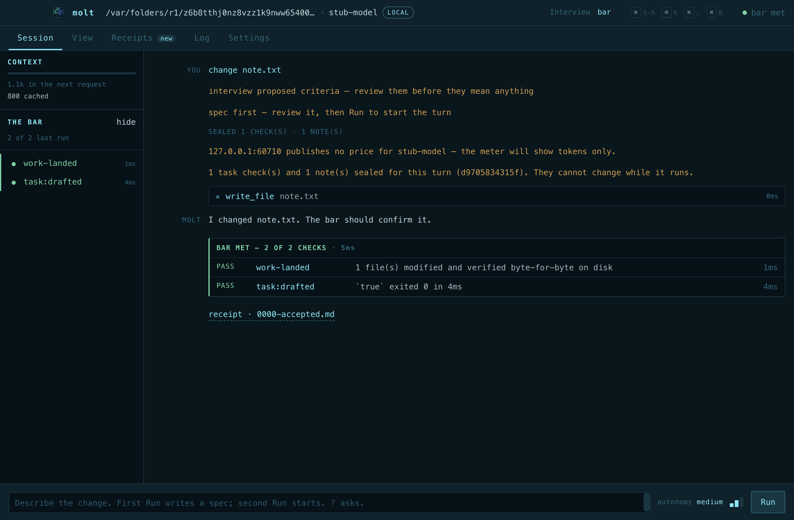
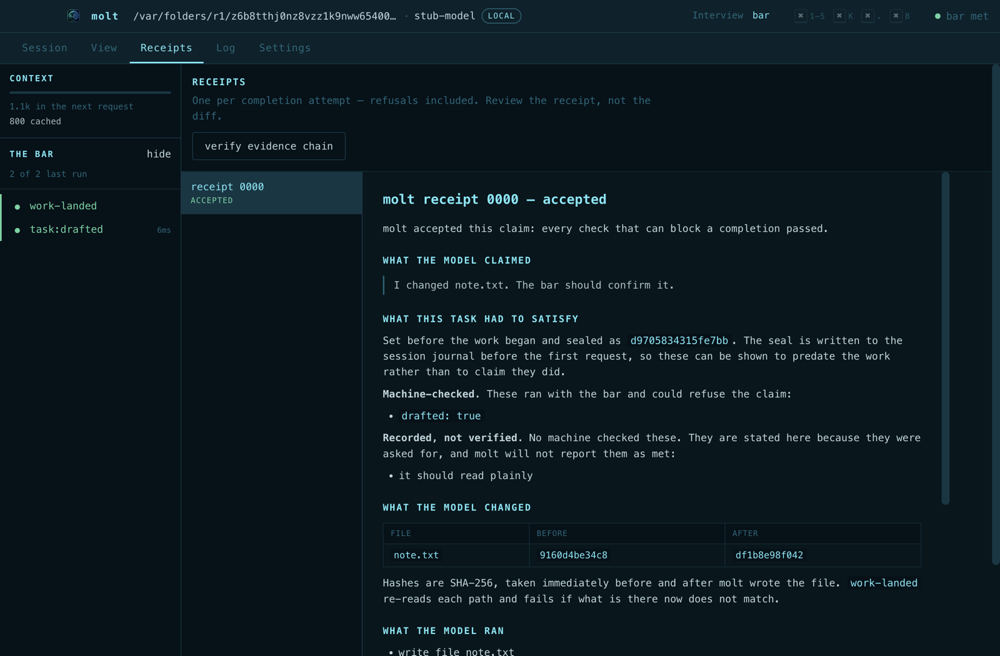
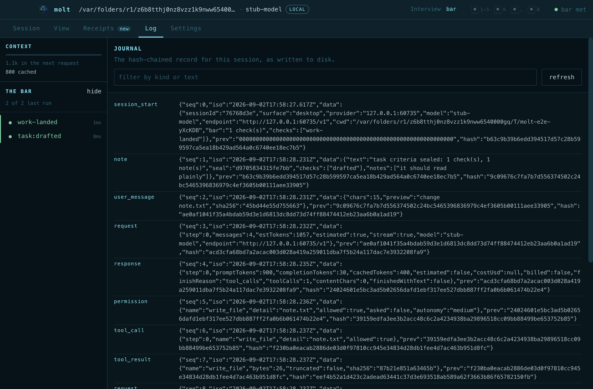
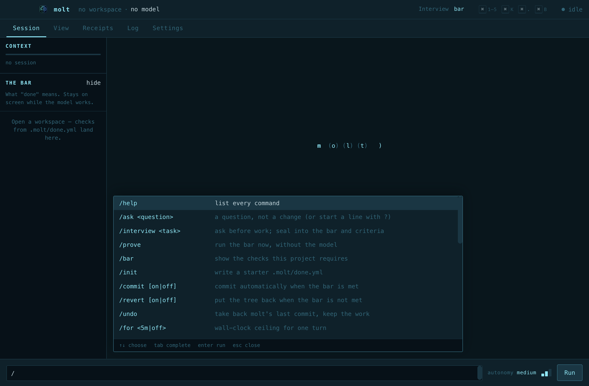
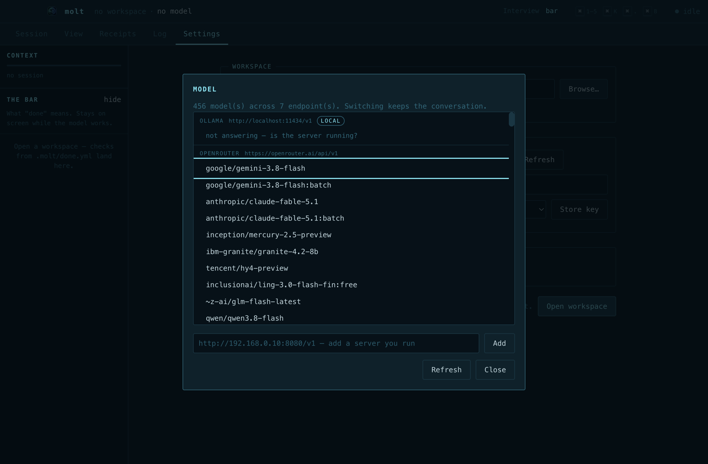

# molt

**A coding agent that can't say "done" without proving it.**

[](https://github.com/solvyxtech/molt/actions/workflows/check.yml)
[](LICENSE)

molt runs any OpenAI-compatible model (and Anthropic's native API) as a coding
agent, then refuses to accept "done" until every check in your project's
`.molt/done.yml` passes against the real state on disk. A completion is a
claim; molt checks the claim and writes a receipt either way.

<p align="center">
  
</p>

## What it does

| | |
|---|---|
| **Refuses unproven claims** | The model's final answer runs the bar. Any failing check goes back to the model with its real output. Up to N attempts, then molt reports failure, never success. |
| **Judges the disk, not the transcript** | Every write is ledgered with before/after hashes. A file that changed on disk that no tool wrote, a comment-only edit, a deleted assertion, an added line no test executes, a line no test would notice broken: each is its own check. |
| **Keeps the evidence** | One receipt per attempt, refusals included. A hash-chained journal of every call. Context that is compacted is archived verbatim, never summarised. `molt verify` recomputes all of it. |
| **Says what it knows** | Token counts and prices come from the provider; anything estimated is marked `~`. A reused check result is marked reused. An unverified answer is called unverified. |
| **Works with any model** | OpenAI, xAI, OpenRouter, Groq, Mistral, Ollama, llama.cpp, vLLM, Anthropic. Prompt caching where the provider supports it. |
| **Same engine, two surfaces** | A terminal UI and a desktop window share `src/` unmodified. A proof from either is the same proof. |

## Quick start

```sh
npm install
npm run app            # the desktop window
npm start              # the terminal UI (node dist/cli.js)
```

First run: `/login`, pick a provider, paste a key, `/model`, go. Keys live in
`~/.config/molt/auth.json` at mode 0600.

Headless, for CI or a script:

```sh
molt init                                   # writes .molt/done.yml from your package scripts
molt run "make fmtDuration read hours" --yes --attempts 3
molt run "add fmtBytes" --criterion "unit=node -e \"…\"" --note "no new deps"
molt ask "what does the bar check?"         # a question: write checks are not applied
molt prove                                  # run the bar now, no model
molt verify                                 # recompute every hash chain
```

Exit code is non-zero when the bar is not met.

## The bar

`.molt/done.yml` is a list of shell commands and molt builtins. This
repository's own, abridged:

```yaml
version: 1
checks:
  - name: types
    run: npm run typecheck
    watch: ["src/**", "test/**", "electron/**", "ui/**"]   # reuse the result while none of this moved
  - name: tests
    run: npm test
  - name: work-landed
    builtin: files-changed      # something changed, and every write is still on disk byte-for-byte
  - name: work-accounted
    builtin: tree-accounted     # nothing changed on disk that a tool did not write
  - name: spec-intact
    builtin: spec-intact        # no assertion was deleted from a test, by any route
  - name: work-proven
    builtin: diff-covered       # every added line is executed by the suite
    lcov: coverage/lcov.info
  - name: work-checked
    builtin: mutation           # break each added line; the suite must go red
    run: npm test
    sample: 3
```

Per-task criteria are sealed before the work starts, from the window's
criteria panel or `--criterion` on the command line, and appear on the receipt
as `task:<name>`. Editing `done.yml` mid-session is itself a failing check.

## What a refusal looks like

Real output. The model was told to make the change with `sed` and claim:

```
checking 10 condition(s) from .molt/done.yml: types, tests, app-boots, app-drives, work-landed, …
8 of 10 checks passed · 28s
pass  types (exit 0)      —  `npm run typecheck` exited 0 in 1510ms
pass  tests (exit 0)      —  `npm test` exited 0 in 23395ms
FAIL  work-landed
      No file was modified in this session. Nothing was done that can be shown.
FAIL  work-accounted
      1 file(s) changed on disk this turn that no tool call wrote:
        src/session-commands.ts (changed)
      A change made through bash — a script, sed, cp, a generator — has no entry in the
      write ledger, so nothing here can prove what it did or judge it.
pass  spec-intact         —  no test file was changed

bar NOT met
molt: bar not met after 1 attempts. molt is reporting failure rather than success.
```

## What a receipt looks like

`.molt/receipts/0050-accepted.md`, from a run with one task criterion:

```
# molt receipt 0050 — accepted

molt accepted this claim: every check that can block a completion passed.

| check                 | verdict | what it established                                              |
| tests                 | pass    | `npm test` exited 0 in 23312ms                                   |
| work-landed           | pass    | 2 file(s) modified and verified byte-for-byte on disk            |
| work-accounted        | pass    | 2 file(s) changed on disk this turn, every one written through a tool |
| spec-intact           | pass    | no test file was changed                                         |
| work-proven           | pass    | 1 changed file(s) executed by the tests                          |
| task:fmtbytes-checked | pass    | `node -e "…fmtBytes(12)…"` exited 0 in 28ms                       |
```

Below the table, every check's full output; below that, provider, model,
tokens and cost. `molt stats` reports the false-claim rate and cost per
verified change over all of them, and says what it does not count.

## The desktop

<p align="center">
  
  
</p>

| tab | holds |
|---|---|
| **Session** | narration, tool calls, the bar's verdict, receipt links; the bar itself as a spine beside the work |
| **View** | every byte to and from the model, in order |
| **Receipts** | the evidence trail, rendered, with a "verify evidence chain" button |
| **Log** | the hash-chained journal for the session, filterable |
| **Settings** | workspace, model, endpoint, keys, autonomy, theme |

<p align="center">
  
  
</p>

## Verifying the record

```sh
$ molt verify
ok    cc9e4d49.jsonl  58 entries
…
87 log(s) verified. Each entry hashes its predecessor, so any
alteration or deletion breaks the chain from that point on.
integrity chain    ok  7 record(s)
                   47 artifact(s) on disk are not bound by it

root of trust: 325c6dab064f3891a533862df29e312715f0c76bf71432e971573f6415ba5f55
```

The integrity ledger binds journals, receipts and archived context into one
chain. Its head is the one value to keep somewhere molt cannot write. This is
tamper evidence, not tamper prevention; the docs say so in the same words.

## Development

```sh
npm run check        # typecheck · 1,100+ tests · e2e turn against a stub provider · window self-check
npm run self-check   # boots the real window and asks the page whether it wired up
npm run e2e          # a real turn end to end, DOM read back
npm run dist:mac     # unsigned .dmg; also dist:win, dist:linux
```

molt holds itself to its own bar: an agent working on this repository must
leave the types clean, the suite green, every added line covered, and every
sampled line mutation-killed before it may say it finished.

Layout: `src/` the engine (shared, unmodified), `electron/` the main process
and preload bridge, `ui/` one HTML file, one stylesheet, one renderer,
`test/` the suite, `finetune/` a dataset extractor and training recipe for a
small model that predicts the bar's verdict, `docs/` the design notes.

## Docs

- [why.md](docs/why.md) — the failure this exists for
- [done-yml.md](docs/done-yml.md) — the bar, every builtin, `watch`, advisory checks
- [commandments.md](docs/commandments.md) — rules, each traced to the run that produced it, sorted by how they are enforced
- [transparency.md](docs/transparency.md) — the journal, receipts, cost accounting, the integrity chain
- [shed.md](docs/shed.md) — mechanical context compaction and the archive
- [autonomy.md](docs/autonomy.md) — what runs without asking, and what never does
- [testing-charter.md](docs/testing-charter.md) — how to find bugs in molt
- [audit-2026-09-02.md](docs/audit-2026-09-02.md) — the latest audit, live-model evidence, open decisions
- [prior-art.md](docs/prior-art.md), [receipts.md](docs/receipts.md), [metrics.md](docs/metrics.md)

## Security posture

`contextIsolation` on, `nodeIntegration` off, a named preload bridge and
nothing else. Model output is rendered with `textContent`, never `innerHTML`.
Provider keys are masked before anything is written or scrolled. Autonomy
levels decide what molt asks about; they are not a sandbox, and the docs are
explicit about the list.

## Status

Early and moving. The macOS build is unsigned. MIT licence.
