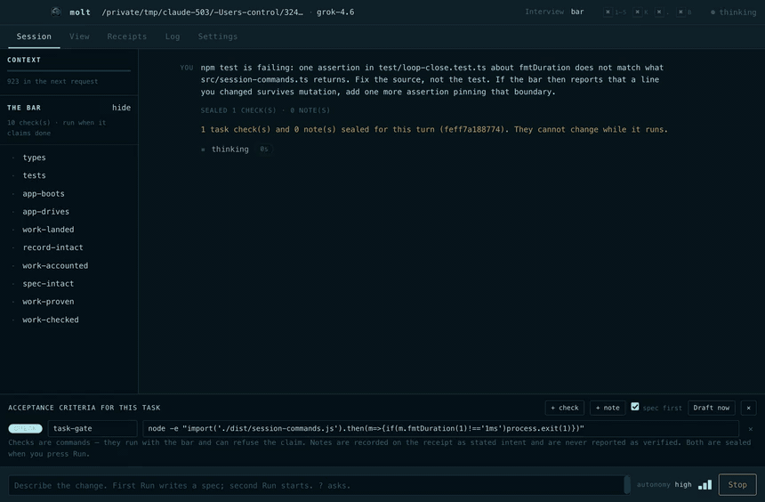
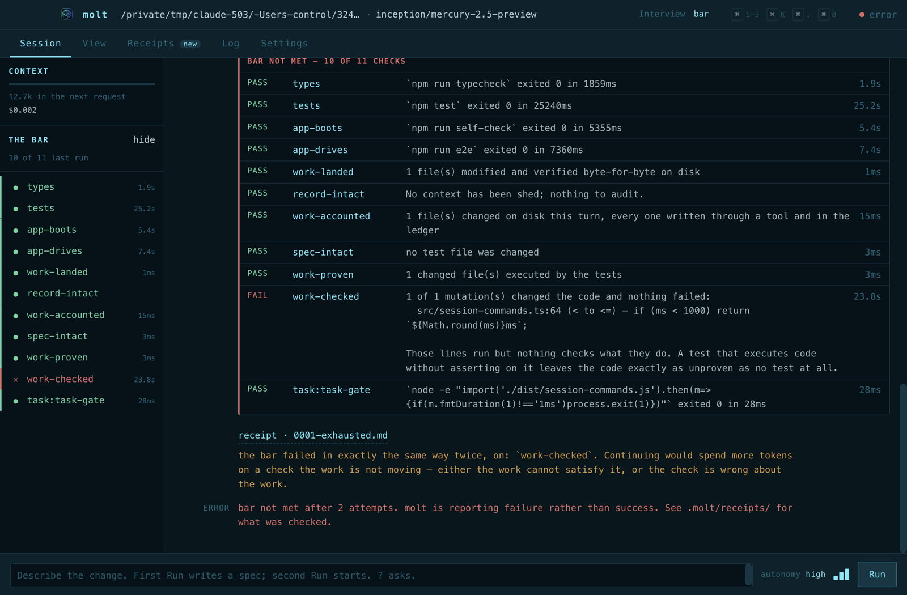
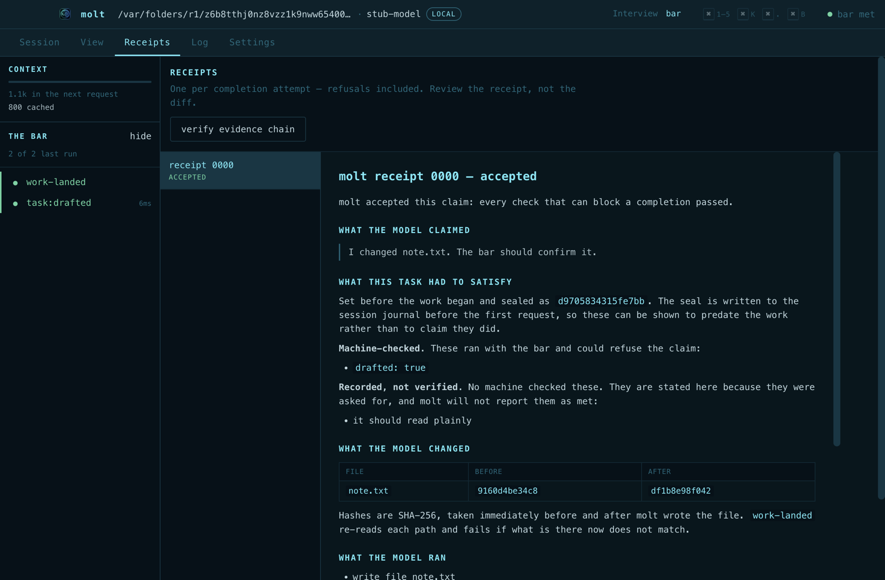
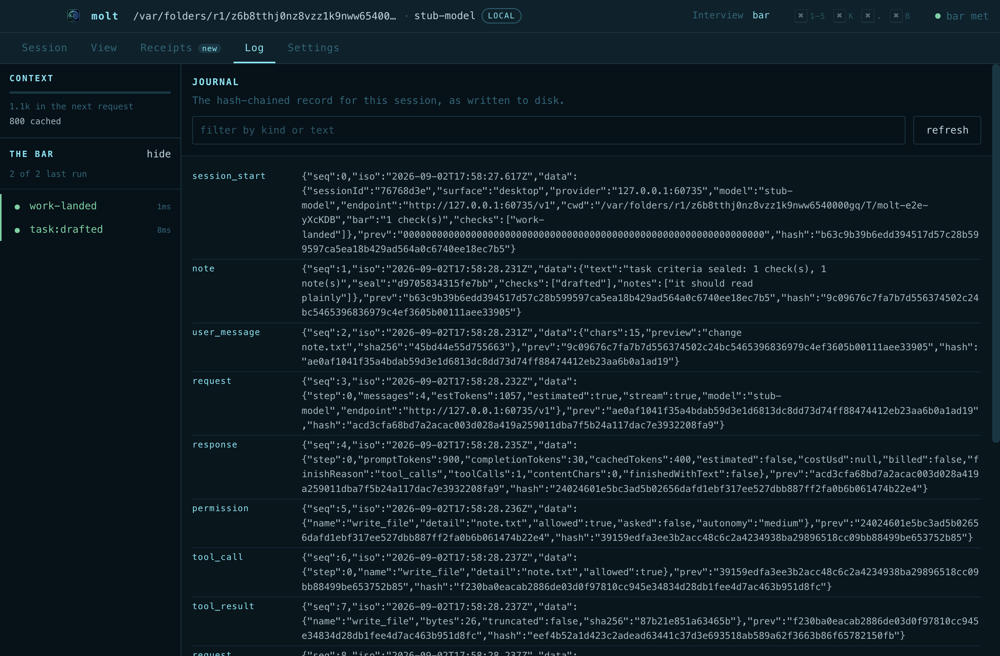
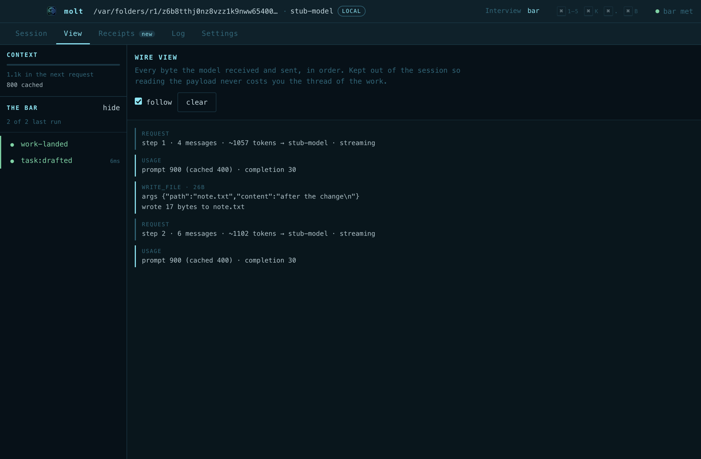
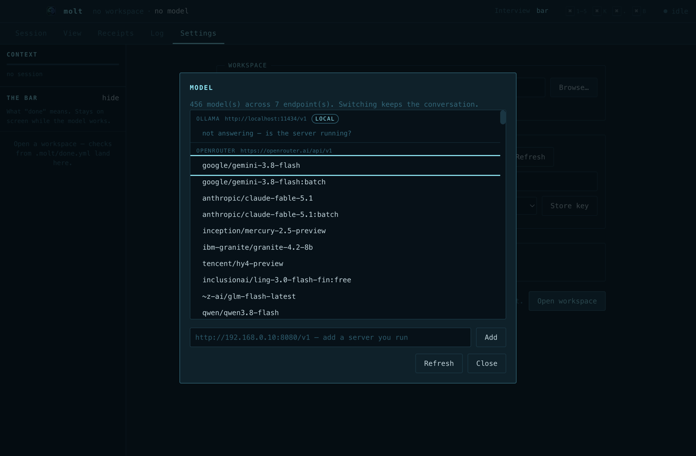
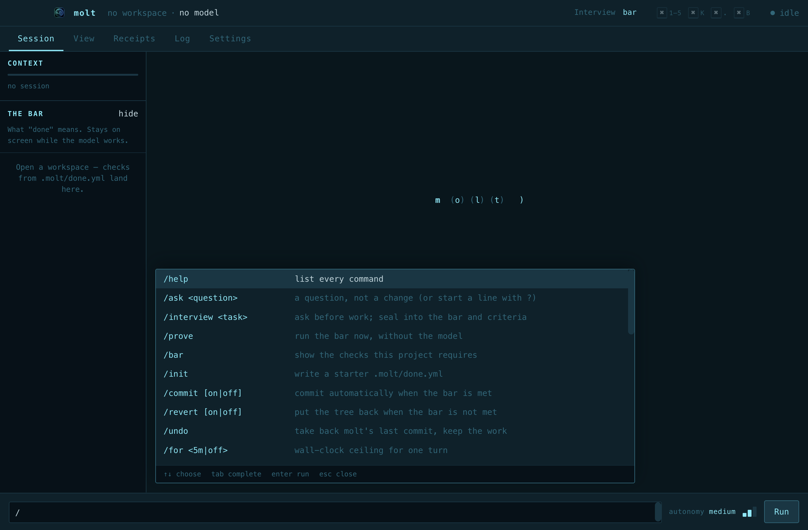

# Maat Agent

**A coding agent that can't say "done" without proving it.**

> Maat (MAH-aht), the Egyptian goddess of truth: in the Weighing of the Heart, a
> claim is weighed against her feather before it may pass. Maat Agent weighs a
> model's "done" against checks set before the work began, on the real disk, and
> writes the verdict down. It is built on the **molt** engine; both the `maat`
> and `molt` commands work.

[](https://github.com/solvyxtech/molt/actions/workflows/check.yml)
[](LICENSE)

Maat Agent is an open source coding agent for developers. Terminal CLI and Electron desktop. Written in TypeScript. It runs any OpenAI compatible model and Anthropic’s native API. Then it refuses to accept done until every check in your project’s `.maat/done.yml` passes (projects that already have `.molt/` keep using it) against the real state on disk. A completion is a claim. Maat checks the claim and writes a receipt either way.

False done does not count. Acceptance lives outside the model. Every write gets before and after hashes. One receipt per attempt including refusals. A hash chained journal you can recompute with `maat verify`.

Studio page: [solvyx.xyz/work/molt](https://solvyx.xyz/work/molt).

How this differs from Stop hooks, Aider, Cursor, and CI alone: [COMPARISONS.md](COMPARISONS.md).

Support ongoing maintenance via [GitHub Sponsors](https://github.com/sponsors/solvyxtech) or [Polar](https://polar.sh/solvyx).

<p align="center">
  
</p>

<p align="center"><em>One turn, unedited, at eight frames a second with the
waiting cut out. molt is pointed at its own source with a real defect in
<code>fmtDuration</code>: grok-4.6 finds it, fixes it, notices that nothing
pins the 1000ms boundary and adds the assertion, then eleven checks run
against the disk — including one that breaks each changed line to confirm a
test notices. Bar met, receipt written. (<a href="docs/images/demo.mp4">mp4</a>)</em></p>

<details>
<summary><strong>The receipt that turn wrote</strong> — unedited, and the whole
thing is <a href="docs/examples/receipt-from-the-demo.md">in this repository</a></summary>

```
# molt receipt 0000 — accepted

molt accepted this claim: every check that can block a completion passed.

## What the model claimed

> Fixed `fmtDuration` so sub-second values stay in milliseconds (`1` → `"1ms"`).
> Added `fmtDuration(1000) === "1s"` so the `< 1000` boundary cannot survive a
> `<=` mutation.

## What this task had to satisfy

Set before the work began and sealed as `feff7a18877439a6`. The seal is written
to the session journal before the first request, so these can be shown to
predate the work rather than to claim they did.

**Machine-checked.** These ran with the bar and could refuse the claim:

- task-gate: node -e "…if (m.fmtDuration(1) !== '1ms') process.exit(1)…"

## What the model changed

| file                       | before         | after          |
| `src/session-commands.ts`  | `a074ca7e1d0f` | `87767c16fa80` |
| `test/loop-close.test.ts`  | `4d5e5b567018` | `df490ce46062` |

Hashes are SHA-256, taken immediately before and after molt wrote the file.
`work-landed` re-reads each path and fails if what is there now does not match.

## What was checked, and what it established

| check          | verdict | what it established                                           |
| types          | pass    | `npm run typecheck` exited 0 in 1741ms                        |
| tests          | pass    | `npm test` exited 0 in 24161ms                                |
| app-boots      | pass    | `npm run self-check` exited 0 in 8474ms                       |
| app-drives     | pass    | `npm run e2e` exited 0 in 6255ms                              |
| work-landed    | pass    | 2 file(s) modified and verified byte-for-byte on disk         |
| record-intact  | pass    | No context has been shed; nothing to audit.                   |
| work-accounted | pass    | 2 file(s) changed on disk, every one written through a tool   |
| spec-intact    | pass    | 1 test file(s) changed, no assertion removed                  |
| work-proven    | pass    | 1 changed file(s) executed by the tests                       |
| work-checked   | pass    | 1 mutation(s) broke a test, as they should                    |
| task:task-gate | pass    | the sealed criterion exited 0 in 33ms                         |

## Session

- when: 2026-09-03T17:42:19.808Z
- attempt: 1
- provider: xai
- model: grok-4.6
- session tokens: 208927
- session cost: $0.2733
- bar duration: 64627ms

Every check passed. This is the evidence behind that claim.
```

Below the table the full receipt carries every check's own output — the
compiler's, the suite's, the mutation report — followed by the thirty tool
calls the turn made, in order. Nothing in it is written by a model.

</details>

## What it does

| | |
|---|---|
| **Refuses unproven claims** | A final answer is a claim, not a result. It runs the bar; any failing check goes back to the model with its real output. After N attempts molt reports failure, never success. |
| **Judges the disk, not the transcript** | Every write is ledgered with before/after hashes. A file that changed on disk that no tool wrote, a comment-only edit, a deleted assertion, an added line no test executes, a line no test would notice broken: each is its own check. |
| **Keeps the evidence** | One receipt per attempt, refusals included. A hash-chained journal of every call. Context that is compacted is archived verbatim, never summarised. `molt verify` recomputes all of it. |
| **Says what it knows** | Token counts and prices come from the provider; anything estimated is marked `~`. A reused check result is marked reused. An unverified answer is called unverified. |
| **Works with any model** | OpenAI, xAI, OpenRouter, Groq, Mistral, Ollama, llama.cpp, vLLM, Anthropic. Prompt caching where the provider supports it. |
| **Same engine, two surfaces** | A terminal UI and a desktop window share `src/` unmodified. A proof from either is the same proof. |

## The loop

```
you ask  →  the model works  →  it says "done"
                                     │
                     .molt/done.yml runs against the disk
                                     │
              ┌──────────────────────┴──────────────────────┐
         every check passed                          something failed
              │                                             │
      receipt: accepted                    the failures go back to the model,
      (and the answer)                     with their real output — it keeps
                                           working, up to N attempts, then
                                           molt reports failure
```

Either way a receipt is written, the journal is appended, and both are
hash-chained.

## Downloads

Same engine, two install paths.

### Desktop

Get **v0.2.2** from the [GitHub release](https://github.com/solvyxtech/molt/releases/tag/v0.2.2) (macOS, Windows, Linux).

macOS builds are unsigned on purpose. On first open, right-click the app, choose Open, then Open again.

### CLI / TUI

The CLI is not on npm (the `@solvyx/molt` package was unpublished on
2026-10-07); build it from source. Needs Node 20.11 or later and git.

```sh
git clone https://github.com/solvyxtech/molt.git maat
cd maat
npm ci
npm run build          # compiles the CLI to dist/cli.js
node dist/cli.js       # interactive TUI (same as: npm start)
node dist/cli.js run "…" --yes    # headless
```

To get `maat` and `molt` commands on your PATH, stage the CLI package and
install it from the local folder (nothing is downloaded from the registry; npm
links the commands to that folder, so keep the clone where it is):

```sh
npm run pack:cli       # builds, then stages the CLI package under out-cli/
npm i -g ./out-cli     # installs the maat and molt commands from that folder
maat --version
```

**Do not** `npm i -g molt` or `npm i -g molt-cli` — those are unrelated
packages on the registry.

Desktop and CLI share one version. See [docs/versioning.md](docs/versioning.md).

## Build from source

For contributors working in this repository:

```sh
npm ci
npm run app            # the desktop window
npm start              # the terminal UI (node dist/cli.js, after npm run build)
npm run pack:cli       # stage the CLI package under out-cli/ (not published to npm)
```

First run: `/login`, pick a provider, paste a key, `/model`, go. Keys live in
`~/.config/molt/auth.json` at mode 0600.

Or use a Grok subscription instead of a key — `/login` → **grok build (your
xAI plan)** in the terminal, **Settings → Model → "Use my Grok plan"** in the
window, or `--url grok-build` headless. Maat drives the official `grok` CLI over
ACP; you sign in with your own SuperGrok / X Premium+ account, and Maat does not
store subscription credentials. For metered use, point at `https://api.x.ai/v1`
with your own API key. Maat is independent and not affiliated with or endorsed
by SpaceXAI — you remain responsible for xAI's terms and acceptable use; do not
pool or resell access. A plan is not a bill, so the meter shows tokens and no
money.

Other providers (OpenAI, Anthropic, OpenRouter, Groq, Mistral, local Ollama /
llama.cpp / vLLM, and the rest) are the same idea: BYOK or your own local
runtime, your account, their terms. See
[docs/provider-terms.md](docs/provider-terms.md) — not legal advice, just how
Maat connects and what it does not claim.

Headless, for CI or a script:

```sh
molt init                                   # writes .molt/done.yml from your package scripts
molt run "make fmtDuration read hours" --yes --attempts 3
molt run "fix the failing test" --criterion "gate=npm test -- fmtDuration"
molt ask "what does the bar check?"         # a question: write checks are not applied
molt prove                                  # run the bar now, no model
molt verify                                 # recompute every hash chain
molt acp                                    # serve ACP on stdio, for an editor's agent panel
```

Exit codes: `0` the bar was met · `1` it was not · `2` usage · `3` finished
without a verdict (no bar, or `--only`/`--skip` left required checks unrun, which
is never reported as a pass), or passed without earning "verified": every check
that could prove the work was written by the worker model itself
(`passed-own-checks`), with `--require-discriminating` none of them failed
before the work (`passed-untested`), or nothing but builtins passed. "Verified" needs a
passing check from another model (`--judge`) or a command check you wrote or
approved; builtins never carry it.

## The bar

`.molt/done.yml` is a list of shell commands and molt builtins. This
repository's own, abridged:

```yaml
version: 1
checks:
  - name: types
    run: npm run typecheck
    watch: ["src/**", "test/**", "electron/**", "ui/**"]   # reuse the result while none of this moved
  - name: tests
    run: npm test
  - name: work-landed
    builtin: files-changed      # something changed, and every write is still on disk byte-for-byte
  - name: work-accounted
    builtin: tree-accounted     # nothing changed on disk that a tool did not write
  - name: spec-intact
    builtin: spec-intact        # no assertion was deleted from a test, by any route
  - name: work-proven
    builtin: diff-covered       # every added line is executed by the suite
    lcov: coverage/lcov.info
  - name: work-checked
    builtin: mutation           # break each added line; the suite must go red
    run: npm test
    sample: 3
```

Per-task criteria are sealed before the work starts, from the window's
criteria panel or `--criterion` on the command line, and appear on the receipt
as `task:<name>`. Editing `done.yml` mid-session is itself a failing check.

## What a refusal looks like

The same defect, a different model. mercury-2.5 fixed it and said the existing
test already covered the change, so `work-checked` broke the line it had just
written and showed that nothing noticed. Ten of eleven, refused — twice the
same way, after which molt stopped rather than spend more:

<p align="center">
  
</p>

The same refusal in the terminal:

```
bar not met — 10 of 11 checks
FAIL  work-checked
      1 of 1 mutation(s) changed the code and nothing failed:
        src/session-commands.ts:64 (< to <=) — if (ms < 1000) return `${Math.round(ms)}ms`;

      Those lines run but nothing checks what they do. A test that executes
      code without asserting on it leaves the code exactly as unproven as no
      test at all.

the bar failed in exactly the same way twice, on: `work-checked`. Continuing
would spend more tokens on a check the work is not moving — either the work
cannot satisfy it, or the check is wrong about the work.
```

A different route, refused by a different check. The model was told to make
the change with `sed` and claim:

```
checking 10 condition(s) from .molt/done.yml: types, tests, app-boots, app-drives, work-landed, …
8 of 10 checks passed · 28s
pass  types (exit 0)      —  `npm run typecheck` exited 0 in 1510ms
pass  tests (exit 0)      —  `npm test` exited 0 in 23395ms
FAIL  work-landed
      No file was modified in this session. Nothing was done that can be shown.
FAIL  work-accounted
      1 file(s) changed on disk this turn that no tool call wrote:
        src/session-commands.ts (changed)
      A change made through bash — a script, sed, cp, a generator — has no entry in the
      write ledger, so nothing here can prove what it did or judge it.
pass·none  spec-intact     —  no test file was changed

bar NOT met
molt: bar not met after 1 attempts. molt is reporting failure rather than success.
```

## What a receipt is for

One is written for every completion attempt, refusals included, and
[the one from the demo](docs/examples/receipt-from-the-demo.md) is in this
repository to read in full.

The right-hand column is the point. "pass" is a header; *what it established*
is the reason to believe the header, and molt used to compute that sentence and
show it only when a check failed — which is backwards, since a failure explains
itself and a pass is the one that has to earn belief.

Refusals are kept for the same reason. A record containing only successes has
the same shape as a record that was curated, and is worth exactly as much.
`molt stats` reports the false-claim rate and the cost per verified change over
all of them, and says plainly what it does not count.

## Judgment

Some claims the scale cannot settle. A check you wrote refused the work, Maat's
own drafted checks disagreed with it, nothing could check it, or it passed its
checks and independent reviewers still found the task contradicted. Most of
these turn out to be good work, so they are neither failures nor passes: each
one opens a case and waits for you.

```
maat judge              step through the cases awaiting judgment
maat judge stats        how often Maat's warnings were true, from your rulings
```

You rule one of three ways: **accept** (the work is right), **send back** (the
work is wrong; your note becomes the next task), or **the check was wrong**
(the work is right, and Maat's check drafter is told not to seal that mistake
again in this project). The desktop has the same thing as the Judgment tab.

A ruling never turns a claim into "verified". Maat did not prove the work; you
judged it, and the record says so. Cases and rulings live in
`.maat/judgment.jsonl`, hash-chained like the journal (`maat judge verify`).

## The desktop

<p align="center">
  
  
</p>
<p align="center">
  
  
</p>

| tab | holds |
|---|---|
| **Session** | narration, tool calls, the bar's verdict, receipt links; the bar itself as a spine beside the work |
| **View** | every byte to and from the model, in order |
| **Receipts** | the evidence trail, rendered, with a "verify evidence chain" button |
| **Log** | the hash-chained journal for the session, filterable |
| **Settings** | workspace, model, endpoint, keys, autonomy, theme |

<p align="center">
  
</p>

## Verifying the record

```sh
$ molt verify
ok    cc9e4d49.jsonl  58 entries
…
87 log(s) verified. Each entry hashes its predecessor, so any
alteration or deletion breaks the chain from that point on.
integrity chain    ok  7 record(s)
                   47 artifact(s) on disk are not bound by it

root of trust: 325c6dab064f3891a533862df29e312715f0c76bf71432e971573f6415ba5f55
```

The integrity ledger binds journals, receipts and archived context into one
chain. Its head is the one value to keep somewhere molt cannot write. This is
tamper evidence, not tamper prevention; the docs say so in the same words.

## Development

```sh
npm run check        # typecheck · 1,100+ tests · e2e turn against a stub provider · window self-check
npm run self-check   # boots the real window and asks the page whether it wired up
npm run e2e          # a real turn end to end, DOM read back
npm run dist:mac     # unsigned .dmg; also dist:win, dist:linux
```

molt holds itself to its own bar: an agent working on this repository must
leave the types clean, the suite green, every added line covered, and every
sampled line mutation-killed before it may say it finished.

Layout: `src/` the engine (shared, unmodified), `electron/` the main process
and preload bridge, `ui/` one HTML file, one stylesheet, one renderer,
`test/` the suite, `finetune/` a dataset extractor and training recipe for a
small model that predicts the bar's verdict, `docs/` the design notes.

## Missions

Work that runs for hours against a contract nobody can edit.

```
molt mission plan "a CLI that turns a CSV of orders into printable labels"
# read and edit .molt/mission/contract.yml and features.json
molt mission run --yes --commit
```

A contract is a list of assertions, each a command whose exit 0 establishes
it. A feature list claims them. A fresh worker session runs per feature, held
to exactly the assertions it claims; when a milestone's features are all done
its assertions run again together and the milestone seals only if they still
pass. There is no orchestrator model and no validator model: the loop is a
loop, and the judge is the commands. `docs/missions.md` has the whole thing.

## Terminal-Bench

`bench/harbor/molt_agent.py` runs molt under harbor on Terminal-Bench 2.0,
installing this tree's CLI into each task container. `bench/harbor/README.md`
has the recipe. Headless runs get `--criteria auto`: acceptance checks for
the task are drafted before the work, they are sealed, and the worker is held
to them. Passing checks the worker model drafted for itself are never
"verified": without `--judge <another model>` (or checks a person approved)
the best a run earns is `passed own checks (<model>), not verified`, exit 3.
Drafted checks are tried on a copy of the project before the work: one that
already passes there, or cannot fail by construction, is sent back to the
drafter once and dropped if the redraft is no better; one that already
passed is still sealed as a refuse-only guard, which can fail the claim but
never makes it verified. `--require-discriminating`
goes further: "verified" then needs an independent value check that failed
before the work, and anything less is `passed checks that did not test this
work, not verified` (exit 3).

## Docs

- [provider-terms.md](docs/provider-terms.md) — BYOK, unaffiliation, provider ToS pointers (not legal advice)
- [why.md](docs/why.md) — the failure this exists for
- [done-yml.md](docs/done-yml.md) — the bar, every builtin, `watch`, advisory checks
- [commandments.md](docs/commandments.md) — rules, each traced to the run that produced it, sorted by how they are enforced
- [transparency.md](docs/transparency.md) — the journal, receipts, cost accounting, the integrity chain
- [shed.md](docs/shed.md) — mechanical context compaction and the archive
- [autonomy.md](docs/autonomy.md) — what runs without asking, and what never does
- [acp-server.md](docs/acp-server.md) — `molt acp`: running molt as an editor's agent (Zed) over the Agent Client Protocol
- [testing-charter.md](docs/testing-charter.md) — how to find bugs in molt
- [audit-2026-09-02.md](docs/audit-2026-09-02.md) — the latest audit, live-model evidence, open decisions
- [prior-art.md](docs/prior-art.md), [receipts.md](docs/receipts.md), [metrics.md](docs/metrics.md)

## Security posture

`contextIsolation` on, `nodeIntegration` off, a named preload bridge and
nothing else. Model output is rendered with `textContent`, never `innerHTML`.
Provider keys are masked before anything is written or scrolled. Autonomy
levels decide what molt asks about; they are not a sandbox, and the docs are
explicit about the list.

## Status

Early and moving. The macOS build is unsigned. Apache 2.0 licence.

## Star

If molt caught a false done for you, starring the repo helps other builders find it.
